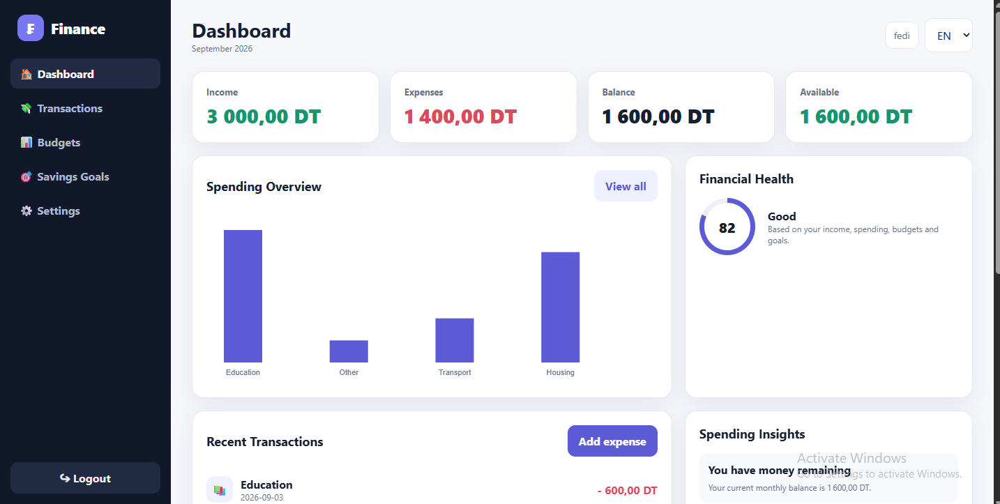
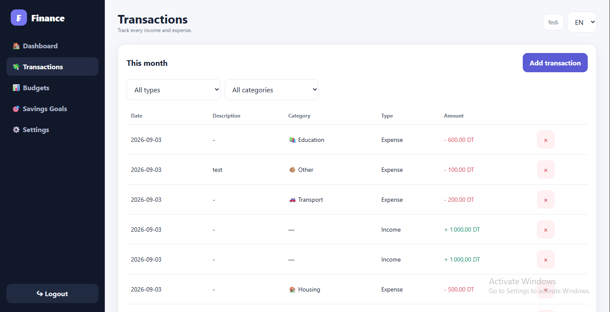
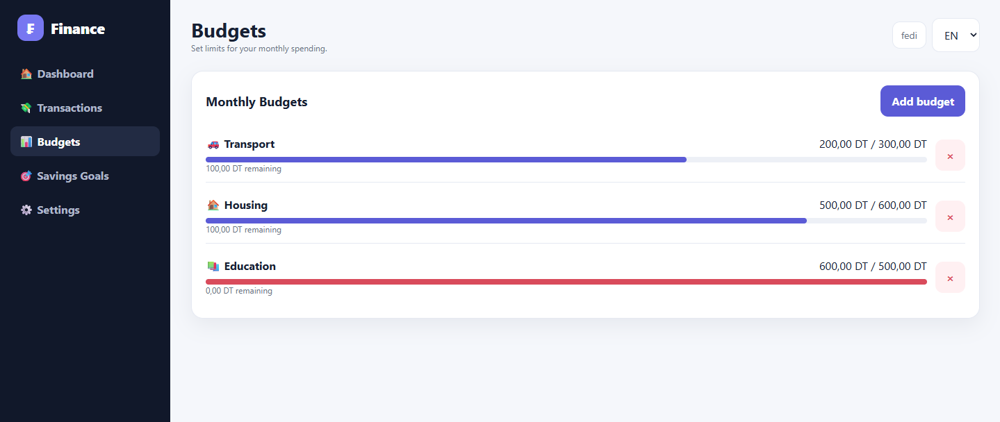

# 💰 Masarif — Personal Finance Manager

> A simple, modern, multilingual personal finance management web application.

**Masarif** is a responsive personal finance web application designed to help users manage their income, expenses, budgets, savings goals, and overall financial health in one place.

Built with **HTML5, CSS3, Vanilla JavaScript, and Firebase**, Masarif provides a clean and accessible experience across desktop and mobile devices.

---

## ✨ Features

### 📊 Financial Dashboard

Get a clear overview of your finances in one place:

* 💰 Monthly income
* 💸 Monthly expenses
* 💵 Current balance
* 🏦 Savings overview
* 📊 Spending overview
* ❤️ Financial health score
* 🧾 Recent transactions
* 💡 Spending insights

### 💸 Transaction Management

Track your daily financial activity:

* Add income
* Add expenses
* Categorize expenses
* Add descriptions
* Set transaction dates
* View transaction history
* Monitor spending patterns

### 📋 Budget Management

Create and monitor monthly budgets:

* Create category-based budgets
* Set spending limits
* Track spending against budgets
* Detect exceeded budgets
* Monitor budget performance

### 🎯 Savings Goals

Set financial goals and track your progress:

* Create savings goals
* Define target amounts
* Track current savings
* Monitor progress
* Identify completed goals

### ❤️ Financial Health Score

Masarif calculates a financial health score using several factors:

* Spending-to-income ratio
* Budget compliance
* Savings rate
* Savings goal progress

The result provides users with a simple way to understand their current financial situation.

### 💡 Spending Insights

Masarif automatically generates useful insights based on financial activity, including:

* Overall balance
* Highest spending categories
* Budget limits
* Savings goal progress
* Spending behavior

### 🌍 Multilingual Interface

Masarif supports three languages:

* 🇬🇧 English
* 🇫🇷 French
* 🇹🇳 Arabic

Arabic automatically switches the interface to **RTL (Right-to-Left)** layout.

### 📱 Responsive Design

The interface is designed for:

* 💻 Desktop
* 📱 Mobile
* 📟 Tablet

### 📲 Progressive Web App

Masarif includes Progressive Web App functionality:

* Web App Manifest
* Service Worker
* Installable application
* Standalone display mode
* Offline caching support

---

# 🛠️ Technology Stack

| Technology              | Purpose                       |
| ----------------------- | ----------------------------- |
| HTML5                   | Application structure         |
| CSS3                    | Styling and responsive design |
| Vanilla JavaScript      | Application logic             |
| Firebase Authentication | User authentication           |
| Cloud Firestore         | Database                      |
| JSON                    | Localization                  |
| Canvas API              | Financial visualization       |
| PWA                     | Installable web application   |

---

# 📁 Project Structure

```text
Masarif/
│
├── index.html
├── login.html
├── register.html
├── dashboard.html
├── transactions.html
├── budget.html
├── goals.html
├── settings.html
│
├── manifest.json
├── service-worker.js
│
├── js/
│   ├── firebase.js
│   ├── auth.js
│   ├── dashboard.js
│   ├── transactions.js
│   ├── budget.js
│   ├── goals.js
│   ├── health.js
│   ├── insights.js
│   ├── i18n.js
│   └── common.js
│
├── locales/
│   ├── ar.json
│   ├── en.json
│   └── fr.json
│
└── docs/
    ├── login.png
    ├── dashboard.png
    ├── transactions.png
    └── budget.png
```

---

# 🚀 Getting Started

## 1. Clone the Repository

```bash
git clone https://github.com/Fedi-Mhadhbi/masarif.git
cd masarif
```

## 2. Configure Firebase

Create a Firebase project and enable:

* Firebase Authentication
* Cloud Firestore

Then configure your Firebase Web App credentials inside:

```text
js/firebase.js
```

Example:

```javascript
const firebaseConfig = {
    apiKey: "YOUR_API_KEY",
    authDomain: "YOUR_PROJECT.firebaseapp.com",
    projectId: "YOUR_PROJECT_ID",
    storageBucket: "YOUR_PROJECT.firebasestorage.app",
    messagingSenderId: "YOUR_SENDER_ID",
    appId: "YOUR_APP_ID"
};
```

> ⚠️ Never commit Firebase service-account credentials, private keys, or other sensitive secrets to GitHub.

## 3. Run Locally

Because Masarif uses JavaScript ES Modules and a Service Worker, it should be served through an HTTP server instead of opening the HTML files directly.

Using Python:

```bash
python -m http.server 8000
```

Then open:

```text
http://localhost:8000
```

---

# 🔥 Firebase / Firestore Structure

Masarif stores user-specific data under the authenticated user's UID.

```text
users/
└── {userId}/
    │
    ├── transactions/
    │   └── {transactionId}
    │
    ├── budgets/
    │   └── {budgetId}
    │
    └── savings_goals/
        └── {goalId}
```

### Transaction Example

```javascript
{
    type: "expense",
    amount: 45,
    category: "food",
    description: "Lunch",
    date: "2026-09-04",
    createdAt: serverTimestamp()
}
```

---

# 🌍 Internationalization

Masarif uses JSON files for translations:

```text
locales/
├── ar.json
├── en.json
└── fr.json
```

The application loads the selected language and updates the interface dynamically.

### Supported Languages

| Language     | Code | Direction |
| ------------ | ---- | --------- |
| 🇬🇧 English | `en` | LTR       |
| 🇫🇷 French  | `fr` | LTR       |
| 🇹🇳 Arabic  | `ar` | RTL       |

---

# 📲 Progressive Web App

Masarif includes PWA functionality using:

```text
manifest.json
service-worker.js
```

On supported browsers, users can install Masarif on their device and launch it as a standalone application.

---

# 🔐 Security

Masarif uses **Firebase Authentication** to manage user accounts and **Cloud Firestore** to store financial data.

Each user's data is organized under their authenticated UID.

For production deployment, Firestore Security Rules should be configured to ensure users can only access their own financial data.

> Never expose Firebase Admin SDK credentials or service-account private keys in the frontend or GitHub repository.

---

# 📸 Screenshots

## 🔐 Login


---

## 📊 Dashboard



---

## 💳 Transactions



---

## 📋 Budget Management



---

# 🎯 Project Objectives

Masarif was created with the goal of making personal finance management simple and accessible.

The project focuses on helping users:

* Understand where their money goes
* Track income and expenses
* Create realistic budgets
* Monitor spending
* Build savings
* Set financial goals
* Understand their financial health
* Make better financial decisions

---

# 🔮 Future Improvements

Potential future improvements include:

* 📈 Advanced financial analytics
* 📊 More detailed charts
* 📅 Custom date-range reports
* 🔔 Budget notifications
* 📤 Export transactions
* 📥 Import financial data
* 🌙 Dark mode
* 🤖 AI-powered financial insights
* ☁️ Improved offline functionality
* 📱 Enhanced mobile experience
* 📄 Financial reports
* 🔄 Data synchronization improvements

---

# 📌 Project Status

🚧 **Active Development**

Masarif is an actively developed personal finance management web application.

---

# 👨‍💻 Author

## Fedi Mhadhbi

Business Computing Developer

Interested in:

* Web Development
* Software Engineering
* Cloud Technologies
* Cybersecurity
* Artificial Intelligence

---

# 📄 License

This project is licensed under the **MIT License**.

See the `LICENSE` file for more information.

---

## ⭐ Support

If you find Masarif useful or interesting, consider giving the repository a ⭐ **Star**.

---

<p align="center">
  Built with ❤️ using HTML, CSS, JavaScript & Firebase
</p>
